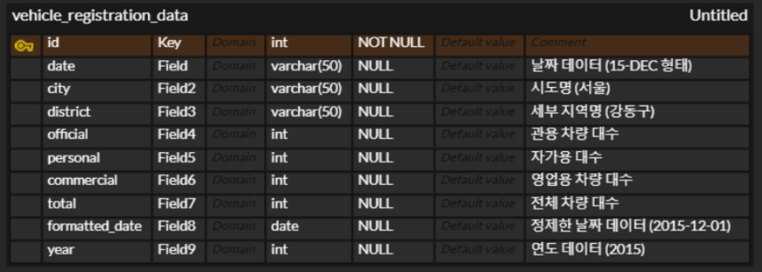

# 하나, 둘, 3조

<div align="center">
  
   
  
</div>

## 🚗 전국 자동차 등록 현황 및 기업 FAQ 조회 시스템

### 💡 프로젝트 개요

>전국 자동차의 2015~2024년까지의 등록 현황을 **시각적으로 분석**하고, 대표적인 자동차 기업들의 **자주 묻는 질문(FAQ) 5가지를 제공**하는 시스템이다.  
이 프로젝트를 통해 사용자들은 **자동차 등록 현황**을 쉽게 이해하고, **자동차 기업들의 주요 정보**를 신속하게 확인할 수 있다.

### 👯‍♂️ 팀 소개

||이종원|박현준|남궁승원|문승기|이태수|장윤홍|
|:---:|:---:|:----:|:-----:|:---:|:----:|:----:|
|github|https://github.com/sto-lee/|https://github.com/phjoon1012/|https://github.com/seungwon923/|https://github.com/tmdekd/|https://github.com/beartaesu/|https://github.com/yuuunong/|
|email|ljw8373@gamil.com|phjoon@umich.edu|dudalapfhd@gmail.com|moon010103@naver.com|beartaesu@naver.com|ccbb15379@naver.com

### 🧑‍💻 주요 기능

- **자동차 등록 현황 시각화 📈**

    - 2015년부터 2024년까지의 등록 데이터를 기반으로 한 그래프 제공

    - 연도별 지역에 따라(전국, 서울, 서울 구) 분석 기능   

- **자동차 기업 FAQ 제공 🔍**

    - 주요 자동차 기업의 대표적인 FAQ 5가지 조회

### 🔧 기술 스택


### 🛢️ 데이터 출처

- 자동차 등록 데이터: 국토교통부 통계누리


- 자동차 기업 FAQ: 해당 기업의 공식 웹사이트   
\[Hyundai FAQ]: https://www.hyundai.com/kr/ko/e/customer/center/faq   
\[Kia FAQ]: https://www.kia.com/kr/customer-service/center/faq   
\[Genesis]: https://www.genesis.com/kr/ko/support/faq.html   
\[Porsche]: https://www.porsche.com/korea/ko/aboutporsche/e-performance/faq/   

### 💾 데이터 정재 및 가져오기

   
[database.sql](./files/sql.sql) 파일을 실행하여 데이터베이스 파일인 [vehicle_registration_data2.csv](./files/vehicle_registration_data2.csv)를 생성

### ERD   
전국 자동차 등록 데이터에 관한 ERD


###  설치 및 실행 방법

1. 저장소 클론
```bash
git clone https://github.com/SKNETWORKS-FAMILY-AICAMP/SKN10-1st-3Team.git  
cd SKN10-1st-3Team
``` 

2. 데이터 불러오기
  - .streamlit/secrets.toml에 맞는 DB 프로젝트 생성 후
  - vehicle_registration_data2.csv를 가져와 데이터베이스 생성

3. 환경에 따른 실행 방법   
가상환경 실행 후 프론트엔드 서버 실행
```bash
./.venv/Scripts/activate   
streamlit run Home.py
```
&emsp;&emsp;로컬에서 실행하고자 한다면 필요한 패키지 다운 후 실행
```bash
pip install -r requirement.txt   
streamlit run Home.py
```

### 🏗️ 화면 설계도


### 🖥️ 실행 화면
#### 1. 홈   
홈 화면에서는 저희 프로젝트의 개요부터 전반적인 프로젝트 설명이 적혀있다.

#### 2. 자동차 등록 현황   
- CARSTATUS 화면은 국내 자동차 등록 현황을 보여주는 화면으로, 2015년부터 2024년까지의 전국과 서울 차량 등록 현황을 분류했고

- 서울의 모든 구에 대해서는 년도별로 차량 등록 현황 표와 막대그래프를 표시한다.

#### 3. FAQ   
- FAQ 화면은 4개의 기업에 대한 FAQ를 보여준다.


### 구현 과정에서 발생한 문제점
- 국토교통부 통계누리에서 수집한 데이터 정제 과정   
  - 천 단위 구분기호 문제
  > SQL 데이터의 특성상 천 단위 구분기호가 포함되어 있어, Streamlit에서 데이터를 실수형으로 잘못 인식하는 문제가 발생했다. 이를 해결하기 위해 그래프를 그릴 때 데이터프레임의 특정 열 값을 x축에 직접 입력하여 올바르게 시각화되도록 처리했다.

  - x축 확장 문제
  > 시각화 과정에서 그래프의 수가 많아질 경우, 모든 그래프가 출력될 때 x축이 확장되어 비효율적으로 표시되는 문제가 발생했다. 이를 해결하기 위해 특정 연도를 선택해 그래프를 출력할 수 있도록 Select Box를 활용하여 x축의 범위를 제한했다.
  


### 📁 프로젝트 폴더 구조

SKN10-1st-3Team/   
├── 📁.streamlit/     
├── 📁.venv/  
├── 📁files/  
│   ├── 🛢️database.sql   
│   ├──  vehicle_registration_data2.csv      
├── 📁images/  
├── 📁pages/  
│   ├── CARSTATUS.py   
│   ├── FAQ.py     
├── 📁Home.py/    
├── 📄README.md  
└── 📄requirement.txt  

---
### 느낀 점

#### 이종원
> 팀장을 맡았지만 팀원분들이 이끌어주셔서 정말 감사했고 재미있었습니다.

#### 박현준
> 이번 프로젝트를 통해 팀원들과 협력하여 전국 자동차 등록 현황을 시각적으로 분석하고, 주요 자동차 기업의 FAQ를 제공하는 유용한 시스템을 제공해보았습니다. 데이터를 수집하고 정제하며, 이를 효과적으로 시각화하기 위해 노력하면서 데이터 분석과 웹 개발에 대한 실무적인 경험을 쌓음과 더불어 프로젝트를 진행하며 문제를 해결하고 기능을 개선하는 과정에서 협업의 중요성과 새로운 기술을 배우는 즐거움을 느낄 수 있는 좋은 경험이었습니다.

#### 남궁승원
> 처음 해보는 프로젝트여서 깃이나 깃허브 사용이 처음이어서 잘 몰라서 많이 헤맸는데 잘 알려주셔서 많은 도움을 받기만 했다. 다음 프로젝트에서는 도움을 받기만 하는 팀원이 아닌 도움을 줄 수 있는 팀원이 되겠다는 생각을 하게 됐다.

#### 문승기
> 부족한 실력이라 걱정도 많이 했고, 부담스러웠지만 팀장님의 리드하에 팀원들과 협업하여 깔끔하고 계획적으로 데드라인을 지킬 수 있어서 다행이었다고 생각합니다. 부족한 실력을 빠르게 채워 2인분을 하는 팀원으로 거듭나겠습니다.

#### 이태수
> 비전공자로서 처음 해보는 프로젝트였는데, 완전 새로운 프로그램들을 사용한다는 것이 새롭고 재밌었습니다. 이번 프로젝트에서는 GPT의 도움을 받아 STREAMLIT을 활용한 UI쪽을 주로 활용하였는데, streamlit을 이해하고 다양한 기능이 있다는 것을 아는데 도움이 되었으며 다음에는 코딩을 꼭 연습해서 적용해보겠습니다.

#### 장윤홍
> 여러가지를 배웠던 것 같습니다. 팀원들과 작업하면서 Github 사용방법, 각자의 branch에서 작업하고 협력하는 방법을 배웠습니다. 또 데이터가 기존에 존재하더라도 프로젝트에 알맞게 활용할 수 있도록 정제해야 한다는 것도 알게 되어서 뜻깊은 활동이었다고 생각합니다.

---
본 프로젝트는 자동차 등록 현황의 이해를 돕고, 여러 자동차 기업의 FAQ를 사용자에게 제공하는 것을 목표로 합니다.
